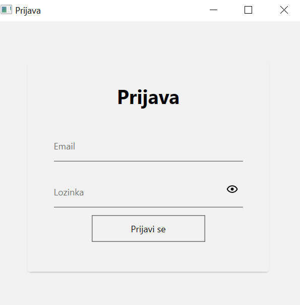
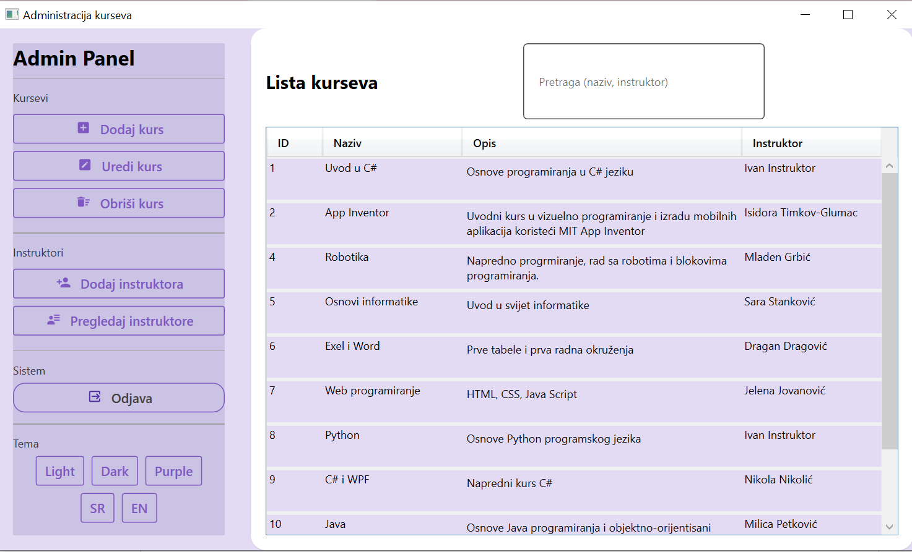
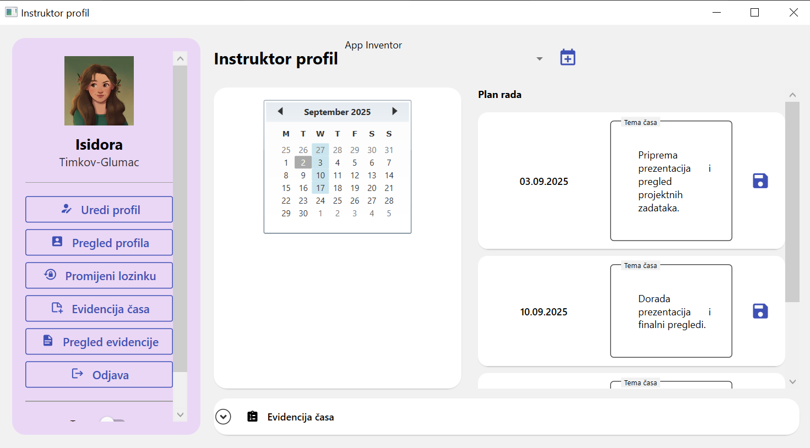
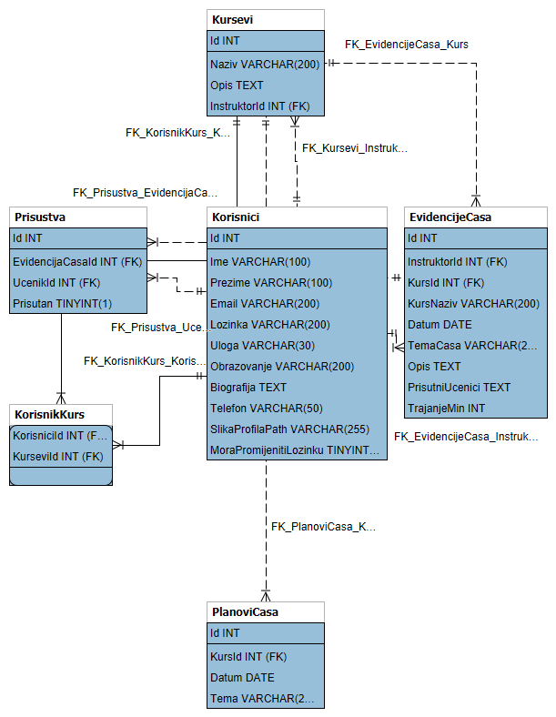

# SkolaProgramiranja

Desktop aplikacija za upravljanje školom programiranja: kursevima, instruktorima, planovima časova i evidencijom prisustva.  
Izrađena u **C# / .NET 8 (WPF)** uz **Entity Framework Core** i **SQLite**. Aplikacija podržava **teme (Light/Dark/Purple)** i **dvojezičnost (SR/EN)**.

---

## Pregled ekrana

### Početni ekran / Prijava


### Admin panel — kursevi


### Instruktor — pregled rada na engleskom jeziku


---

##  Funkcionalnosti

###  Administrator
- **CRUD**: kursevi, instruktori, planovi časova, evidencije časova, prisustva.
- **Upis učenika na kurs** (N:N Korisnik–Kurs).
- **Pretraga** po nazivu kursa i/ili instruktoru.
- **Dvoklik** na red u tabeli otvara formu za **uređivanje**.
- **Tema** (Light/Dark/Purple) i **jezik** (SR/EN) iz UI.
- **Odjava**.

###  Instruktor
- Pregled sopstvenih kurseva i **plana rada** (datum/tema).
- Vođenje **evidencije časa**: tema, opis, prisutni učenici, trajanje.
- Brza promjena **teme** i **jezika**.
- **Obavezna promjena lozinke** pri prvoj prijavi.

### Zajedničko
- Material Design stilovi (moderni WPF UI).
- Snackbar poruke (uspjeh/greška), hover/selekt stilovi, jasna navigacija.

---

##  Baza podataka

- **EF Core + SQLite** (Code-First).
- Entiteti:  
  `Korisnik`, `Kurs`, `PlanCasa`, `EvidencijaCasa`, `Prisustvo` i veza M:N `KorisnikKurs`.
- Ograničenja:
  - `Prisustvo`: unikatno **(EvidencijaCasaId, UcenikId)**.
  - `PlanCasa`: unikatno **(KursId, Datum)**.
  - `Kurs.InstruktorId` → FK ka `Korisnik(Id)` (restrikt brisanje).




---

## 🛠 Tehnologije

- **.NET 8 / WPF**
- **Entity Framework Core** + **Microsoft.Data.Sqlite (SQLite)**
- **MaterialDesignInXaml** (UI stilovi)
- Visual Studio 2022 / EF Core Tools

---

## ▶ Instalacija i pokretanje

### Preduslovi
- **.NET SDK 8**
- **Visual Studio 2022** (Desktop development with .NET)

### 1) Kloniraj repo
```bash
git clone https://github.com/<tvoj-username>/SkolaProgramiranja.git
cd SkolaProgramiranja
