# Škola programiranja – Korisničko uputstvo

## 1.0 Prijava u sistem

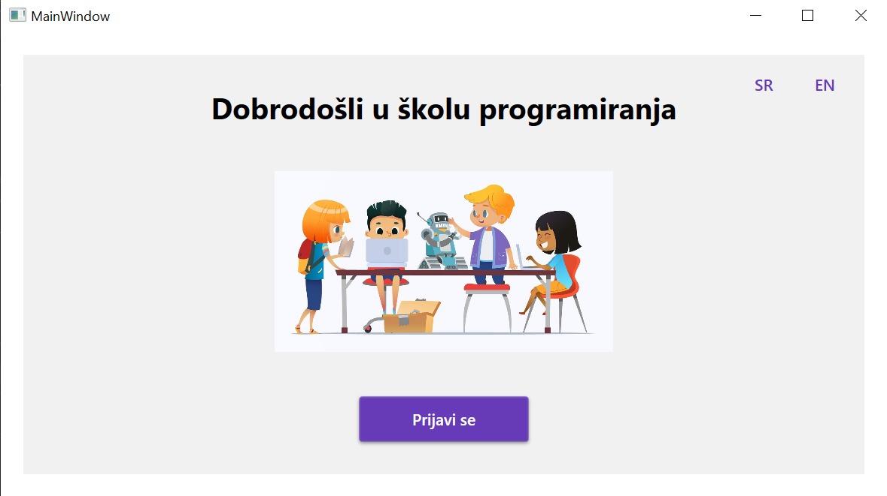
*Slika 1.1 – početni ekran*  
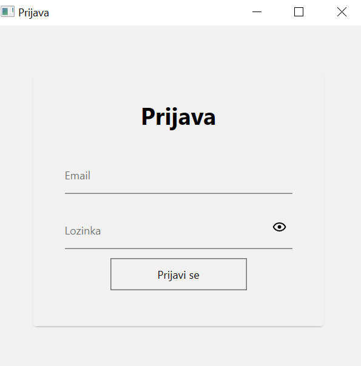

*Slika 1.2 – prijava u sistem*

### 1.1 Otvorite aplikaciju
Kada pokrenete aplikaciju, prikazaće vam se početna stranica na kojoj se nalazi:  
- Dugme **Prijavi se**  
- Dugme za odabir jezika (srpski/engleski)

### 1.2 Forma za prijavu
Klikom na dugme **Prijavi se** otvara se forma koja sadrži dva polja:  
- **Email** – jedinstvena adresa (ime@skola.com)  
- **Lozinka** – sigurnosni ključ za pristup nalogu  
Savjet: koristite *Prikaži lozinku* da provjerite unos prije slanja.

### 1.3 Prijava u sistem
Nakon unosa podataka kliknite **Prijavi se** (ili Enter).

### 1.4 Provjera podataka
- Ako su podaci tačni → ulazite na glavni ekran.  
- Ako nisu → prikazuje se poruka “Neispravan email ili lozinka”.

---

## 2.0 Uputstvo za korištenje sistema – Administrator

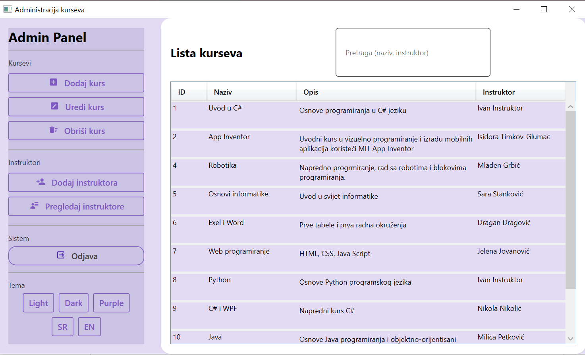
*Slika 2.0 – administrator interfejs*

Kada se prijavite kao administrator, otvara se forma sa navigacijom (Dodaj kurs, Uredi kurs, Obriši kurs, Dodaj/Pregledaj instruktora, Odjava).

### Glavne funkcionalnosti administratora

#### 2.1 Pregled i pretraga kurseva
- Tabela (ID, Naziv, Opis, Instruktor)  
- Pretraga po kursu ili instruktoru  
- Sortiranje po kolonama  
- Dvoklik na red → otvara **Uredi kurs**

#### 2.2 CRUD nad kursevima
- **Dodaj kurs** – forma sa obaveznim poljima  
- **Uredi kurs** – izmjena postojećeg zapisa  
- **Obriši kurs** – uz potvrdu  
- Validacija: ne dozvoljava prazna polja

#### 2.3 Upravljanje instruktorom
- Dodavanje instruktora (ime, prezime, email, lozinka)  
- Pregled instruktora (ko vodi koje kurseve)  
- Povezivanje kursa i instruktora u formi kursa

#### 2.4 Korisničko iskustvo i navigacija
- Lijevi meni – kursevi, instruktori, sistem  
- Desni panel – lista kurseva + pretraga  
- Obavještenja preko snackbar-a

#### 2.5 Tema i jezik
- **Tema**: Light / Dark / Purple  
- **Jezik**: SR / EN

#### 2.6 Odjava i sigurnost
- Odjava → povratak na login ekran  
- Admin panel dostupan samo korisnicima sa rolom *Admin*

## Prikaz interfejsa - *Admin*

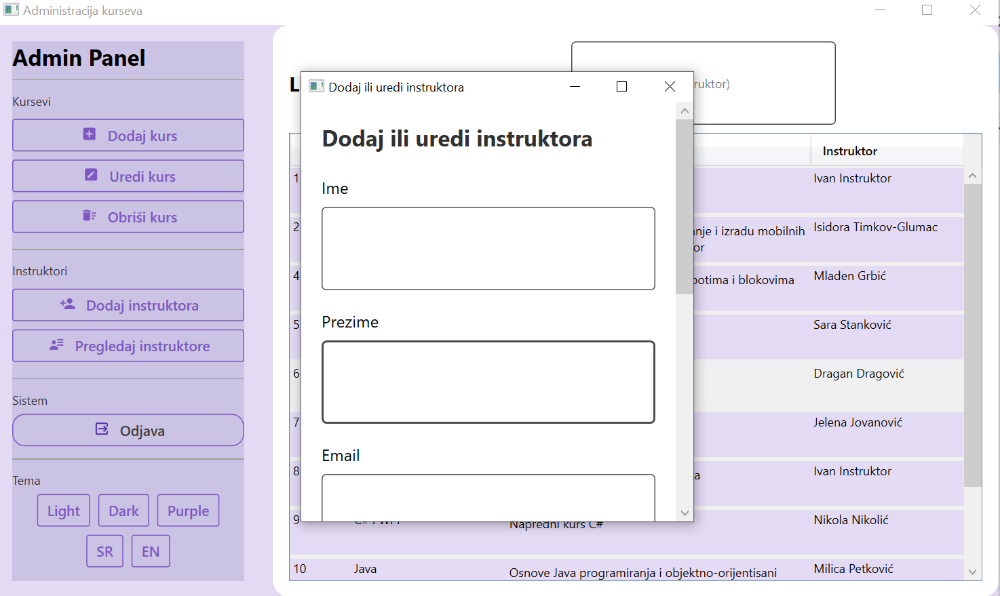
*Slika 2.1 – dodavanje instruktora*

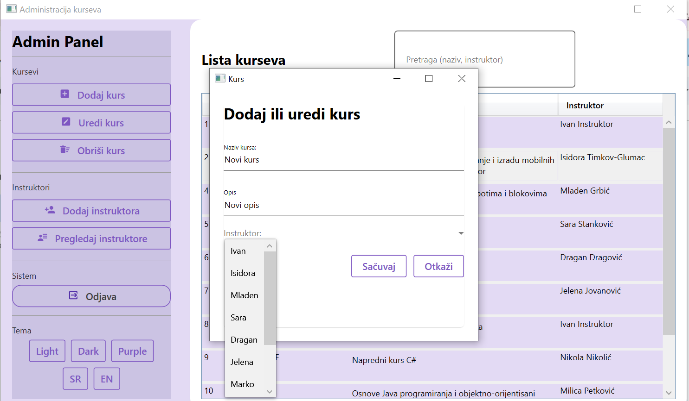
*Slika 2.2 – dodavanje kursa*

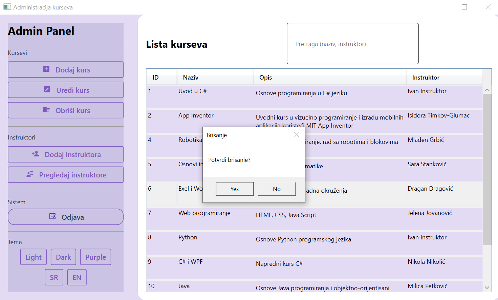
*Slika 2.3 – brisanje kursa*

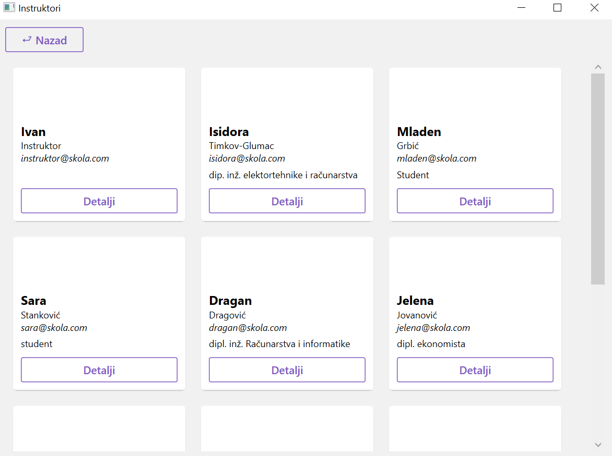
*Slika 2.4 – pregled instruktora*

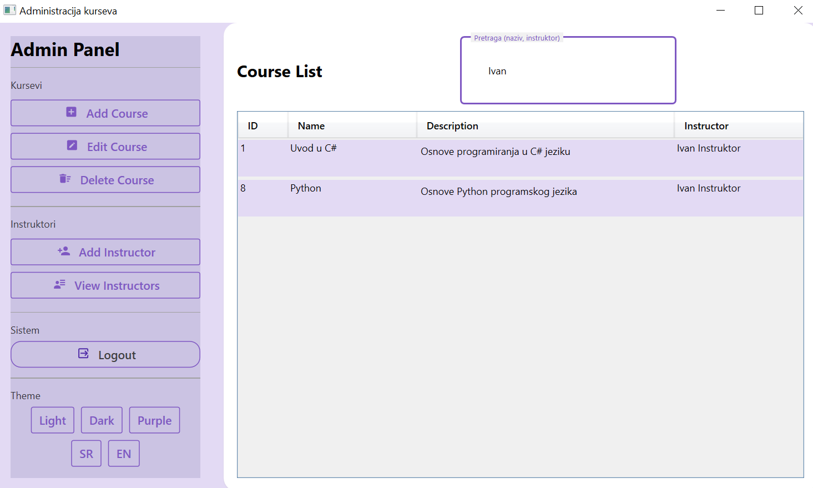
*Slika 2.5 – pretraga instruktora*

---

## 3.0 Uputstvo za korištenje sistema – Instruktor

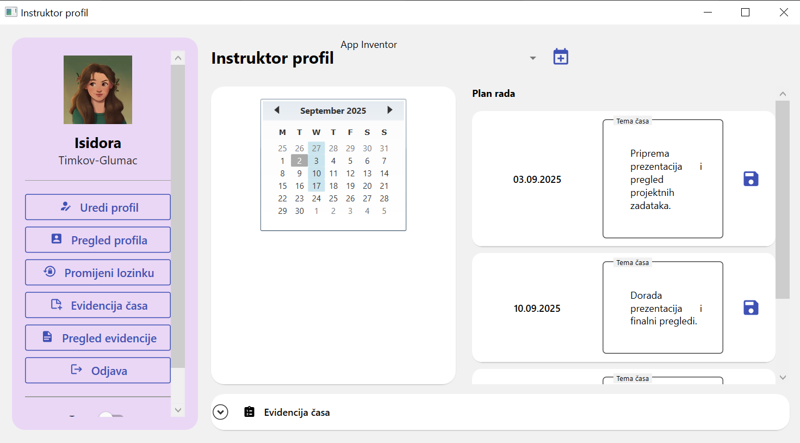
**Slika 3.0 – instruktor interfejs**

Instruktor ima pristup samo sopstvenim kursevima (plan rada, evidencije).  
Administratorske opcije nisu dostupne.

### Glavne funkcionalnosti instruktora

#### 3.1 Pregled i izbor kurseva
- Izbor kursa preko ComboBox-a  
- Filtrira kalendar, plan rada i evidencije

#### 3.2 Kalendar časova
- Prikazuje termine iz plana rada i evidencije  
- Vizuelno označava datume

#### 3.3 Plan rada
- Svaka stavka = datum + tema  
- Klik na disketu → snimanje  
- Dodavanje novog plana (Ctrl+N)

#### 3.4 Evidencija časova
- Tema časa + prisutni učenici  
- Hronološki prikaz (najnovije na vrhu)

#### 3.5 Profil i lozinka
- Pri prvoj prijavi → obavezna promjena lozinke  
- Kasnije moguće uređivanje profila i lozinke

#### 3.6 Tema i jezik
- Promjena teme i jezika dostupna odmah

#### 3.7 Ograničenja
- Instruktor ne može dodavati/brisati globalne kurseve ili instruktore  
- Ima pristup samo svojim kursevima

#### 3.8 Odjava
- Dugme **Odjava** → povratak na login ekran

## Prikaz interfejsa - *Instruktor*

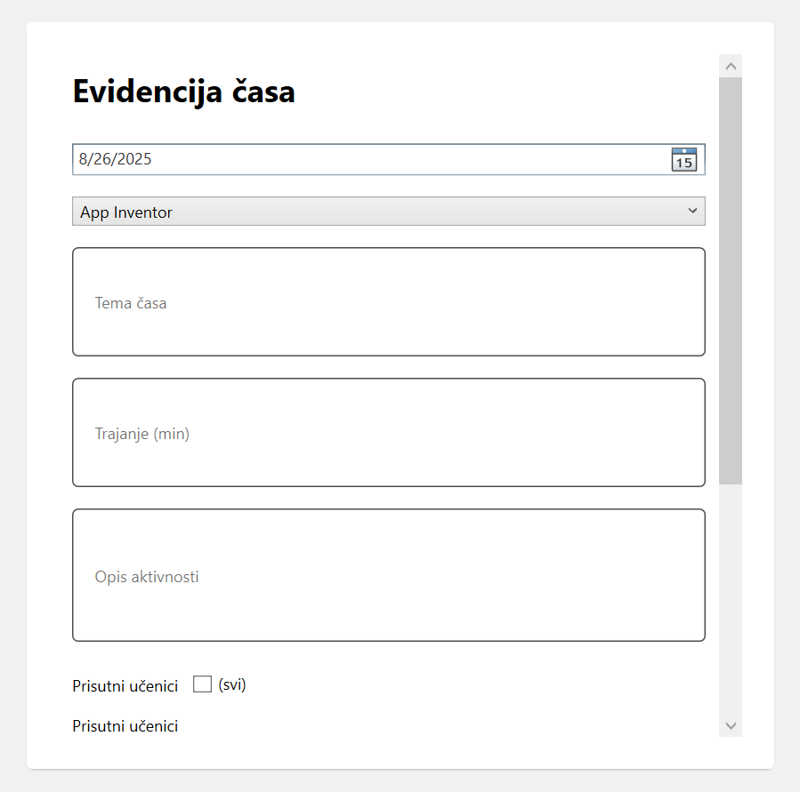
*Slika 3.1 – kreiraj evidenciju*

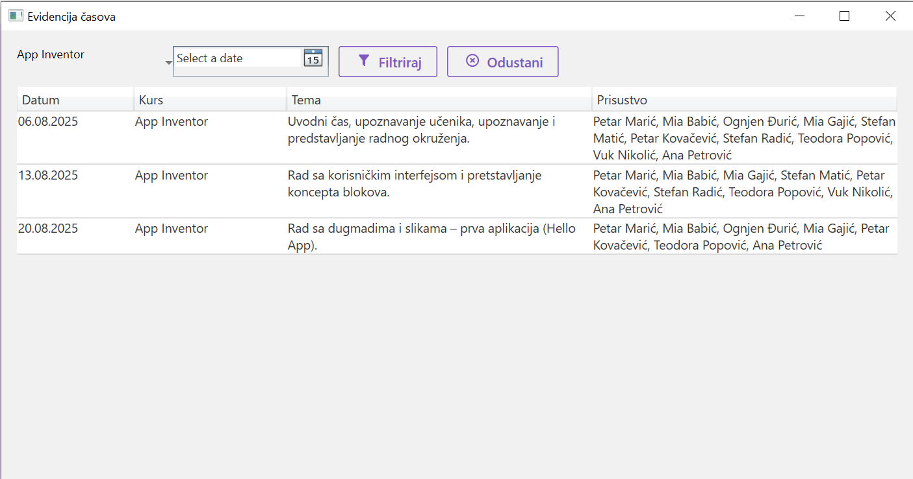
*Slika 3.2 – evidencija casa*

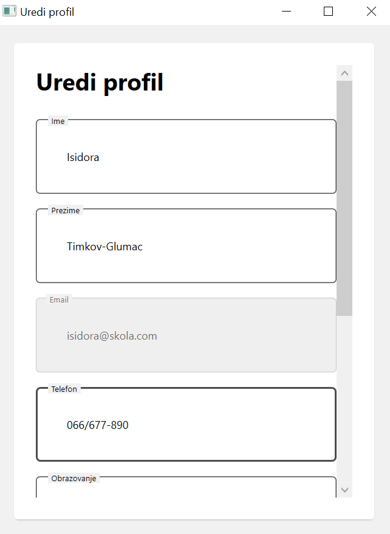

*Slika 3.3 – uređivanje profila*

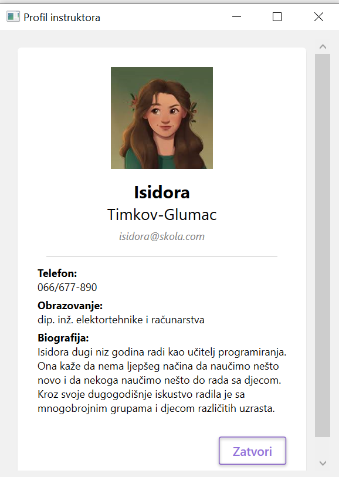

*Slika 3.4 – prikaz profil instruktora*

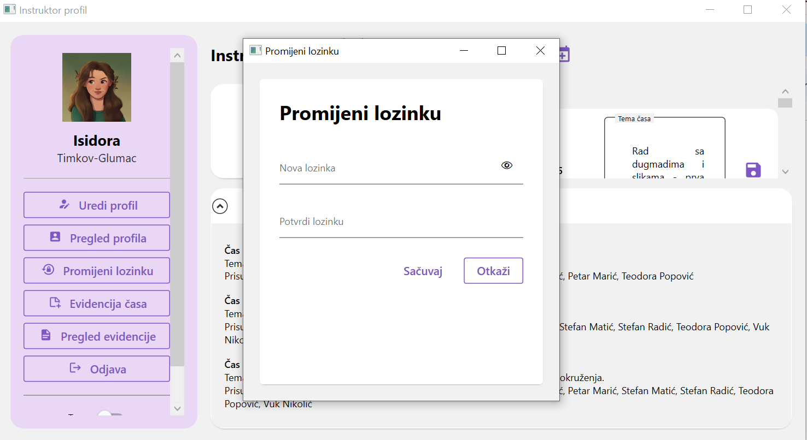

*Slika 3.5 – promjena lozinke*

---
